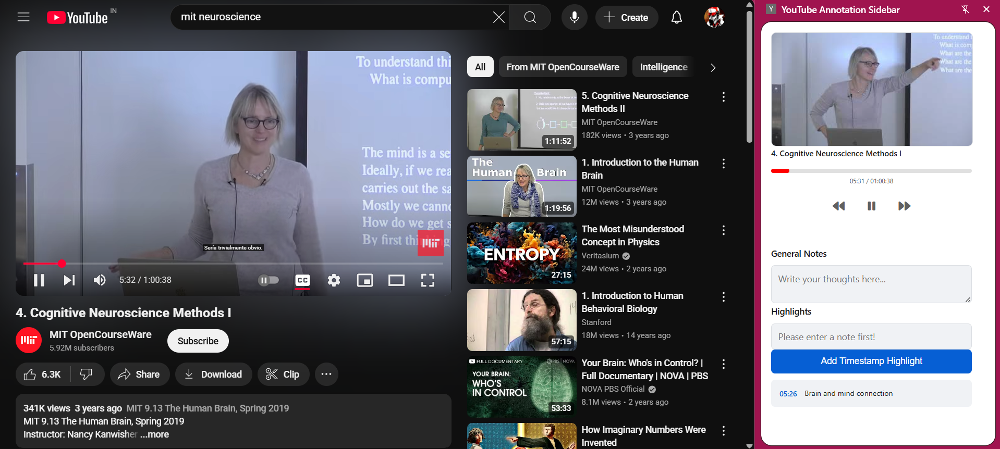

# YouTube Study & Annotation Sidebar

A browser extension that enhances your YouTube viewing experience by adding powerful note-taking and playback control tools in a persistent sidebar. Turn passive video watching into an active learning and research session.

> **Note:** Please add a screenshot of your extension here! Take a picture of the sidebar next to a YouTube video and save it as `screenshot.png` in the project folder. It will automatically appear below.
>
> 

## About The Project

This tool was born from the need to do more with online video content than just watch it. Whether you're a student watching a lecture, a developer following a tutorial, or a researcher analyzing content, this extension provides the tools to engage deeply with the material.

The sidebar automatically detects the video you're playing and gives you a dedicated workspace to control playback, write down summaries, and bookmark key moments with timestamped, clickable notes. All your work is automatically saved and reloaded when you return to a video, keeping your research organized and accessible.

## Key Features

- ✅ **Smart Video Tracking:** Automatically detects the active YouTube video, even when you switch tabs.
- ⏯️ **Convenient Playback Controls:** A "remote control" with icons to play/pause, rewind, and fast-forward the video without needing to be on the YouTube tab.
- 📊 **Rich UI:** Displays the video's thumbnail, title, and a real-time progress bar.
- 📝 **Persistent General Notes:** A dedicated space for free-form notes and summaries that are saved automatically for each video.
- 📌 **Timestamped Highlights:** Instantly capture the current timestamp and add a specific, custom note for that moment.
- 🖱️ **Clickable Timestamps:** Jump directly to a bookmarked moment in the video by clicking on your highlight.
- 💾 **Automatic Saving:** All your notes and highlights are saved to your browser's local storage and reloaded when you revisit a video.

## How to Install and Run

This extension is not yet on the Chrome Web Store, so it needs to be loaded as an "unpacked extension."

1.  **Download the Code:**

    - Clone this repository or download it as a ZIP file and unzip it to a folder on your computer.

2.  **Open Chrome Extensions:**

    - Open your Chrome browser and navigate to `chrome://extensions`.

3.  **Enable Developer Mode:**

    - In the top-right corner of the Extensions page, find the **Developer mode** switch and turn it **ON**.

4.  **Load the Extension:**

    - A new set of buttons will appear. Click on **"Load unpacked"**.
    - A file selection dialog will open. Navigate to and select the entire project folder (the one containing `manifest.json`).

5.  **Done!**
    - The "YouTube Annotation Sidebar" extension will now appear in your extensions list and in your browser's toolbar.

## How to Use

1.  Navigate to any YouTube video page (e.g., `https://www.youtube.com/watch?v=...`).
2.  Click the extension's icon in your browser toolbar to open the sidebar.
3.  The sidebar will automatically load the video's information.
4.  Use the playback controls to manage the video.
5.  Type in the "General Notes" section to save your thoughts. Your progress is saved automatically.
6.  To create a highlight, type a note in the "Type your note..." input box and click "Add Timestamp Highlight".
7.  Click on any created highlight to jump the video to that exact time.

## Tech Stack

- **Platform:** Chrome Browser Extension
- **Manifest:** Manifest V3
- **Core:** JavaScript (ES6+)
- **UI:** HTML5 & CSS3
- **Icons:** [Font Awesome](https://fontawesome.com/)

## Current Status & Roadmap

The core functionality of the extension is implemented and largely stable. All notes and controls work as intended.

However, there is a known synchronization bug that is currently being worked on:

- **The "Off-by-One" Bug:** When navigating between videos in the same tab, the sidebar UI is sometimes one step behind, showing the details of the previous video. This is the top priority to fix.

### Future Features

- [ ] **Fix Synchronization Bug:** Solve the "off-by-one" issue to ensure the UI is always perfectly in sync with the active video.
- [ ] **Export Functionality:** Implement a feature to export all notes and highlights for a video into a clean, portable format like Markdown (`.md`) or a text file (`.txt`).
- [ ] **Editable Highlights:** Allow users to edit the text of a highlight after it has been created.
- [ ] **Delete Notes/Highlights:** Add buttons to remove individual highlights or clear all notes for a video.
- [ ] **Search & Filter:** For videos with many highlights, add a search bar to filter notes.
